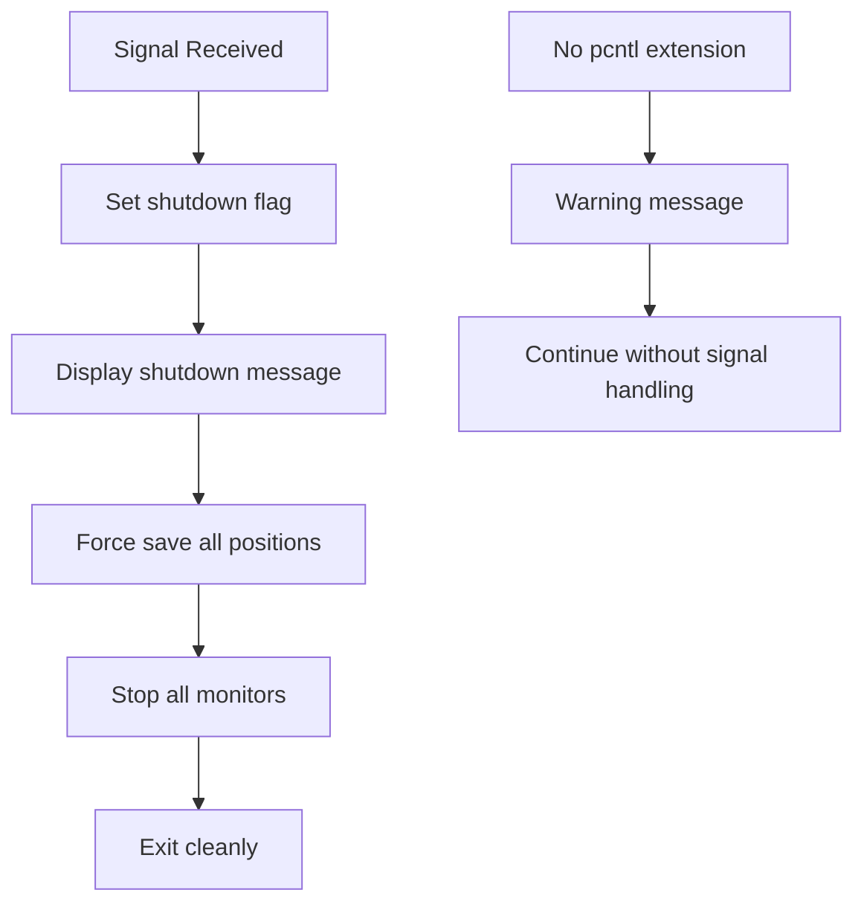

# Graceful Shutdown Implementation

## Overview

The log monitor application implements graceful shutdown handling to ensure that file positions are not lost when the process is interrupted. This is critical for maintaining data integrity and preventing duplicate log processing.

## Problem Statement

Without graceful shutdown handling, the following scenarios would cause position loss:

1. **Ctrl+C (SIGINT)**: Immediate termination without saving current positions
2. **Ctrl+Z (SIGTSTP)**: Process suspension without cleanup
3. **Kill command (SIGTERM)**: Immediate termination without saving positions
4. **System shutdown**: No opportunity to save current state

## Solution Implementation

### 1. Signal Handling

The application listens for system signals using the `pcntl` extension:

```php
// Handle SIGINT (Ctrl+C)
pcntl_signal(SIGINT, function () {
    $this->handleShutdownSignal('SIGINT (Ctrl+C)');
});

// Handle SIGTERM (kill command)
pcntl_signal(SIGTERM, function () {
    $this->handleShutdownSignal('SIGTERM');
});

// Handle SIGTSTP (Ctrl+Z) - suspend
pcntl_signal(SIGTSTP, function () {
    $this->handleShutdownSignal('SIGTSTP (Ctrl+Z)');
});
```

### 2. Graceful Shutdown Process

When a signal is received, the application:

1. **Sets shutdown flag**: Prevents new monitoring cycles from starting
2. **Forces position save**: Immediately saves current positions for all monitors
3. **Stops all monitors**: Calls `stop()` on each monitor with proper cleanup
4. **Exits cleanly**: Returns with success status

```php
private function performGracefulShutdown(): void
{
    $this->output->writeln('<info>Stopping all monitors...</info>');

    foreach ($this->monitors as $monitor) {
        try {
            // Force save current position immediately
            $monitor->forceSavePosition();
            
            // Stop the monitor
            $monitor->stop();
        } catch (\Exception $e) {
            $this->output->writeln("<error>Error stopping monitor: {$e->getMessage()}</error>");
        }
    }

    $this->output->writeln('<info>Graceful shutdown completed. All positions saved.</info>');
}
```

### 3. Enhanced Position Saving

The `LogMonitor` class includes a `forceSavePosition()` method that immediately saves the current position:

```php
public function forceSavePosition(): void
{
    if ($this->positionTracker !== null && $this->currentLogFile !== null) {
        $this->debugLogger->position("Force saving current position for graceful shutdown");
        $this->positionTracker->updatePosition($this->currentLogFile->path, $this->lastPosition);
        $this->positionTracker->forceSave();
    }
}
```

### 4. Periodic Signal Dispatch

The main monitoring loop includes periodic signal dispatch to ensure signals are handled promptly:

```php
while (!$this->shutdownRequested) {
    // Dispatch signals periodically to ensure they are handled
    if (function_exists('pcntl_signal_dispatch')) {
        pcntl_signal_dispatch();
    }
    \Amp\delay(1);
}
```

## Signal Handling Details

### Supported Signals

| Signal | Description | Action |
|--------|-------------|--------|
| SIGINT | Ctrl+C | Graceful shutdown with position saving |
| SIGTERM | kill command | Graceful shutdown with position saving |
| SIGTSTP | Ctrl+Z | Graceful shutdown with position saving |

### Signal Handling Flow



## Testing Graceful Shutdown

### Demo Script

Run the demo script to test graceful shutdown:

```bash
php examples/graceful-shutdown-demo.php
```

This script demonstrates:
- Signal handling capabilities
- Position saving during shutdown
- Proper cleanup procedures

### Manual Testing

1. **Start the monitor**:
   ```bash
   php src/console.php monitor config/projects.yaml --debug
   ```

2. **Test Ctrl+C**:
   - Press Ctrl+C in the terminal
   - Verify positions are saved in the positions directory

3. **Test kill command**:
   - Find the process ID: `ps aux | grep console.php`
   - Send SIGTERM: `kill -TERM <pid>`
   - Verify graceful shutdown

4. **Test Ctrl+Z**:
   - Press Ctrl+Z in the terminal
   - Verify graceful shutdown

## Configuration Requirements

### PHP Extensions

The graceful shutdown requires the `pcntl` extension:

```bash
# Install pcntl extension (Ubuntu/Debian)
sudo apt-get install php-pcntl

# Install pcntl extension (macOS with Homebrew)
brew install php
# pcntl is included by default

# Check if pcntl is available
php -m | grep pcntl
```

### Fallback Behavior

If the `pcntl` extension is not available:
- A warning message is displayed
- The application continues without signal handling
- Positions are still saved during normal monitoring cycles
- Manual interruption may cause position loss

## Position Persistence Strategy

### Immediate Saving

Positions are saved immediately after each monitoring cycle:

```php
// Save position if position tracking is enabled
if ($this->positionTracker !== null) {
    $this->positionTracker->updatePosition($this->currentLogFile->path, $this->lastPosition);
    $this->debugLogger->position("Saved position for {$this->currentLogFile->filename}: {$this->lastPosition}");
}
```

### Force Save on Shutdown

During graceful shutdown, positions are force-saved:

```php
// Force save any remaining positions before stopping
if ($this->positionTracker !== null) {
    $this->debugLogger->position("Force saving positions before stopping");
    $this->positionTracker->forceSave();
}
```

## Error Handling

### Signal Handler Errors

If signal handling fails:
- Error messages are logged
- The application continues running
- Positions are still saved during normal operation

### Monitor Stop Errors

If stopping a monitor fails:
- Error messages are displayed
- Other monitors continue to be stopped
- The shutdown process continues

## Benefits

1. **Data Integrity**: No position loss during process interruption
2. **No Duplicate Processing**: Resumes from the correct position after restart
3. **Clean Shutdown**: Proper cleanup of resources
4. **User Feedback**: Clear messages about shutdown progress
5. **Robust Error Handling**: Continues operation even if signal handling fails

## Limitations

1. **pcntl Extension Required**: Full signal handling requires the pcntl extension
2. **Immediate Termination**: If the process is killed with SIGKILL, no graceful shutdown occurs
3. **System-level Signals**: Some system-level signals cannot be caught

## Best Practices

1. **Install pcntl Extension**: Ensure the pcntl extension is available for full signal handling
2. **Test Signal Handling**: Use the demo script to verify signal handling works correctly
3. **Monitor Position Files**: Check position files to ensure they are being saved correctly
4. **Use Appropriate Signals**: Use SIGTERM instead of SIGKILL when possible
5. **Log Shutdown Events**: Monitor application logs for shutdown-related messages 